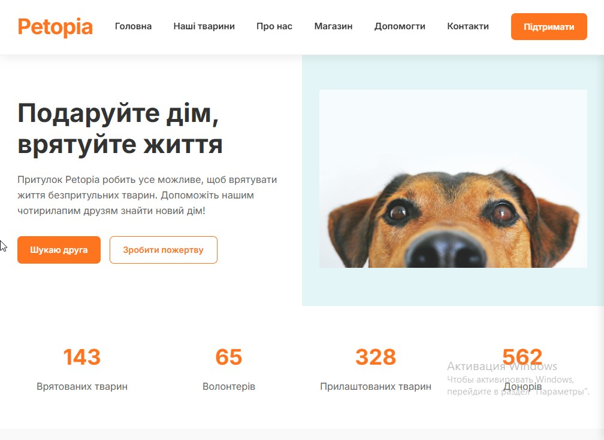

# 🐾 Petopia — Сайт-візитка притулку для тварин

**Petopia** — це сучасний, адаптивний та функціональний сайт-візитка, створений спеціально для притулку для тварин. Він допомагає користувачам дізнатися більше про притулок, переглянути доступних до усиновлення тварин та дізнатися, як можна допомогти.



---

## 🌟 Особливості

- **Головна сторінка**: Привітальна сторінка, яка презентує місію притулку.
- **Про нас**: Детальна сторінка про місію та цінності притулку.
- **Сторінка усиновлення**: Динамічний список доступних до усиновлення тварин із детальними профілями.
- **Профілі тварин**: Індивідуальні сторінки для кожної тварини з фото, описом та деталями усиновлення.
- **Контактна сторінка**: Форма для зв'язку з притулком.
- **Сторінка допомоги**: Інформація про те, як користувачі можуть підтримати притулок, включаючи пожертви та волонтерство.
- **Пошукова функція**: Дозволяє користувачам шукати конкретних тварин або інформацію.
- **Адаптивний дизайн**: Сайт чудово працює на комп'ютерах, планшетах та мобільних пристроях.

---

## 🛠️ Технології

- **PHP** (54.3%): Використовується для серверної логіки та динамічного контенту.
- **CSS** (34.4%): Забезпечує сучасний та адаптивний дизайн.
- **JavaScript** (11.3%): Додає інтерактивність та динамічні елементи.

---

## 📂 Структура проєкту

### Основні файли та папки

- `style.css`: Визначає візуальний стиль сайту.
- `functions.php`: Основні функції та хуки WordPress для теми.
- `header.php`, `footer.php`, `sidebar.php`: Структурні компоненти сайту.
- `front-page.php`: Шаблон для головної сторінки.
- `page-about.php`, `page-adoption.php`, `page-animals.php`, `page-contact.php`, `page-help.php`: Специфічні шаблони для окремих сторінок.
- `single-animal.php`: Шаблон для індивідуальних профілів тварин.
- `404.php`: Обробляє помилки "Сторінку не знайдено".
- `template-parts/`: Містить багаторазові компоненти шаблонів.
- `inc/`: Додаткові функції та конфігурації теми.
- `acf-fields-import.json`: Використовується для імпорту налаштувань Advanced Custom Fields (ACF).
- `screenshot.jpg`: Прев'ю теми для WordPress.

---

## 🚀 Як встановити

1. **Клонуйте репозиторій**:
   ```bash
   git clone https://github.com/Pavlitoo/Petopia.git
   ```

2. **Завантажте у WordPress**: Скопіюйте файли репозиторію у директорію `wp-content/themes/` вашої установки WordPress.

3. **Активуйте тему**:
   * Увійдіть до панелі адміністратора WordPress.
   * Перейдіть до `Зовнішній вигляд > Теми` та активуйте тему **Petopia**.

4. **Імпортуйте налаштування ACF** (за необхідності):
   * Використовуйте файл `acf-fields-import.json` для імпорту налаштувань плагіну ACF.

---

## 📑 Огляд сторінок

* **Головна сторінка** (`front-page.php`): Підкреслює місію та ключові особливості притулку.
* **Про нас** (`page-about.php`): Розповідає історію та цінності притулку.
* **Усиновлення** (`page-adoption.php`): Список доступних до усиновлення тварин.
* **Тварини** (`page-animals.php`): Галерея всіх тварин у притулку.
* **Контакти** (`page-contact.php`): Контактна форма для запитів.
* **Допомога** (`page-help.php`): Інформація про способи підтримки притулку.

---

## 🤝 Як долучитися

Ми завжди раді новим ідеям та внескам! Якщо ви хочете допомогти:

1. Форкніть репозиторій.
2. Створіть нову гілку:
   ```bash
   git checkout -b feature/your-feature
   ```

3. Закомітьте ваші зміни:
   ```bash
   git commit -m 'Add new feature'
   ```

4. Запуште до гілки:
   ```bash
   git push origin feature/your-feature
   ```

5. Відкрийте Pull Request.

---

## 📫 Контакти

* 📸 Instagram: @your_instagram
* ✈️ Telegram: @your_telegram
* ✉️ Email: pavlitoo@example.com *(змініть на вашу реальну пошту)*

*"Petopia — де кожна лапка знайде свій дім."* 🐾
